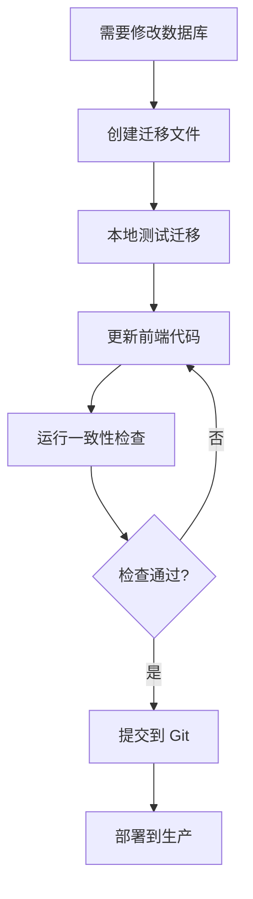

# 数据库版本控制指南

## 概述

本指南说明如何确保前端代码和数据库 schema 的一致性，避免因代码变更导致的数据不匹配问题。

## 当前架构

你的项目使用 **Supabase** 作为后端，目前有：
- ✅ **前端代码管理**: Git (GitHub)
- ❌ **数据库迁移**: 无（这是问题所在）
- ✅ **数据库快照**: 刚刚创建 (`database/snapshot/20250210_baseline_schema.sql`)

## 问题分析

当你修改前端代码（如添加新字段、改变数据结构）时，如果没有对应的数据库迁移记录：
1. **本地开发**可能使用了手动更新的数据库
2. **其他环境**或**未来部署**时数据库结构不匹配
3. **数据丢失或错误**的风险

## 解决方案：三层保护机制

### 第一层：数据库快照（Baseline）

**文件**: `database/snapshot/20250210_baseline_schema.sql`

这是你当前数据库的完整 schema 快照，包含：
- ✅ 所有表结构（words, sessions, daily_stats, user_achievements, user_settings, session_words）
- ✅ 所有 RLS 策略（行级安全）
- ✅ 所有索引
- ✅ 所有函数

**使用方式**：
```bash
# 在新环境中重建数据库
psql -h [host] -U [user] -d [database] -f database/snapshot/20250210_baseline_schema.sql
```

### 第二层：迁移文件（Migrations）

**目录**: `database/migrations/`

每次修改数据库结构时，创建一个新的迁移文件：

```
database/migrations/
├── 20250210_baseline.sql          # 初始快照（从 baseline 复制）
├── 20250215_add_avatar_field.sql   # 示例：添加用户头像字段
├── 20250220_fix_daily_stats.sql    # 示例：修复统计逻辑
└── 20250225_add_indexes.sql        # 示例：添加新索引
```

**命名规范**: `YYYYMMDD_descriptive_name.sql`

**迁移文件模板**：
```sql
-- ================================================================
-- Migration: Add user avatar field
-- Date: 2025-02-15
-- Author: Your Name
-- Related Issue: #123
-- ================================================================

-- 1. Add column (backwards compatible)
ALTER TABLE public.users
ADD COLUMN IF NOT EXISTS avatar_url TEXT;

-- 2. Add index for performance
CREATE INDEX IF NOT EXISTS users_avatar_url_idx
ON public.users(avatar_url);

-- 3. Update RLS if needed
-- (none for this example)

-- 4. Rollback instructions (commented out)
-- ALTER TABLE public.users DROP COLUMN avatar_url;
-- DROP INDEX IF NOT EXISTS users_avatar_url_idx;

-- ================================================================
-- Testing checklist:
-- [ ] Tested locally
-- [ ] Frontend code updated
-- [ ] Backwards compatible with old data
-- [ ] Rollback tested
-- ================================================================
```

### 第三层：前后端一致性检查

**文件**: `scripts/check-backend-frontend-alignment.js`

创建一个脚本来自动检查前端 TypeScript 接口和数据库 schema 是否匹配：

```javascript
// scripts/check-backend-frontend-alignment.js
// 自动检查前端接口定义和数据库 schema 的一致性
// （需要实现）
```

## 工作流程

### 日常开发流程



### 步骤详解

1. **创建迁移文件**
   ```bash
   # 复制模板
   cp database/migrations/template.sql database/migrations/20250215_my_change.sql
   ```

2. **编写迁移 SQL**
   - 使用 `IF NOT EXISTS` 确保幂等性
   - 考虑向后兼容性
   - 添加回滚说明（注释）

3. **本地测试**
   ```bash
   # 使用 Supabase CLI 本地测试
   supabase db reset

   # 或手动在测试环境执行
   psql ... -f database/migrations/20250215_my_change.sql
   ```

4. **更新前端代码**
   ```typescript
   // types.ts
   export interface WordEntry {
     // 添加新字段
     newField?: string;
   }
   ```

5. **提交到 Git**
   ```bash
   git add database/migrations/20250215_my_change.sql
   git add types.ts
   git commit -m "feat: add new field to words table"
   ```

## 灾难恢复

### 场景 1：前端代码和数据库不匹配

**症状**: API 报错、字段缺失、类型错误

**解决方案**:
```bash
# 1. 检查当前 Git commit
git log --oneline -n 10

# 2. 找到对应的数据库迁移
ls database/migrations/ | sort

# 3. 确认数据库状态
psql ... -f database/snapshot/verify_current_state.sql

# 4. 恢复到一致状态
# 选项 A: 回滚前端代码
git checkout [previous-commit]

# 选项 B: 应用缺失的迁移
psql ... -f database/migrations/[missing-migration].sql
```

### 场景 2：需要全新部署

**在新环境中**:
```bash
# 1. 从 baseline 创建数据库
psql ... -f database/snapshot/20250210_baseline_schema.sql

# 2. 按顺序应用所有迁移
for migration in database/migrations/*.sql; do
    psql ... -f "$migration"
done

# 3. 验证
psql ... -f database/snapshot/verify_current_state.sql
```

### 场景 3：数据库意外损坏

```bash
# 1. 检查 Supabase 自动备份（通常保留 7 天）
# 通过 Supabase Dashboard -> Database -> Backups

# 2. 如果备份太旧，使用我们的 schema + 数据导出
pg_dump [connection-string] > data_backup.sql

# 3. 重建 schema
psql ... -f database/snapshot/20250210_baseline_schema.sql

# 4. 恢复数据（选择性导入）
psql ... -f data_backup.sql
```

## 自动化脚本

### 创建检查脚本

在 `scripts/` 目录下创建：

1. **`check-db-schema.js`** - 检查当前数据库 schema
2. **`apply-migration.js`** - 应用迁移文件
3. **`verify-frontend-backend.js`** - 验证前后端一致性

### 集成到 CI/CD

在 `.github/workflows/` 添加：

```yaml
name: Database Schema Check

on: [push, pull_request]

jobs:
  check-schema:
    runs-on: ubuntu-latest
    steps:
      - uses: actions/checkout@v2
      - name: Check migration files
        run: |
          # 验证迁移文件语法
          # 检查前后端一致性
          node scripts/verify-frontend-backend.js
```

## 最佳实践

### ✅ DO（推荐做法）

1. **每个数据库变更都有迁移文件**
2. **迁移文件命名清晰、有注释**
3. **测试迁移的幂等性（可重复执行）**
4. **保持向后兼容**
5. **提交前运行一致性检查**
6. **定期清理备份表**（如 words_old, sessions_old）

### ❌ DON'T（避免做法）

1. ❌ 直接在 Supabase Dashboard 修改生产数据库
2. ❌ 修改了数据库但忘记创建迁移
3. ❌ 迁移文件没有注释
4. ❌ 没有测试就部署到生产
5. ❌ 使用不可逆的操作（如 DROP COLUMN 没有备份）

## 下一步行动

### 立即行动

1. ✅ **提交 baseline schema**（已完成）
   ```bash
   git add database/snapshot/20250210_baseline_schema.sql
   git commit -m "feat: add database schema baseline snapshot"
   ```

2. **创建 migrations 目录**
   ```bash
   mkdir -p database/migrations
   ```

3. **复制 baseline 到 migrations**
   ```bash
   cp database/snapshot/20250210_baseline_schema.sql \
      database/migrations/20250210_baseline.sql
   ```

4. **提交当前状态到 Git**
   ```bash
   git add database/
   git commit -m "feat: establish database version control system"
   git push
   ```

### 后续改进

- [ ] 添加自动化检查脚本
- [ ] 配置 CI/CD 集成
- [ ] 清理旧的备份表
- [ ] 编写数据迁移指南
- [ ] 添加性能监控

## 快速参考

### 常用命令

```bash
# 查看所有迁移
ls -la database/migrations/

# 验证当前 schema
psql [url] -f database/snapshot/verify_current_state.sql

# 应用单个迁移
psql [url] -f database/migrations/20250215_change.sql

# 导出当前数据
pg_dump [url] > backup_$(date +%Y%m%d).sql
```

### 文件结构

```
database/
├── snapshot/
│   ├── 20250210_baseline_schema.sql    # 完整 schema
│   └── verify_current_state.sql        # 验证脚本
├── migrations/
│   ├── 20250210_baseline.sql
│   └── 20250215_*.sql                  # 未来迁移
└── README.md                           # 本文件
```

## 总结

通过建立这个三层保护机制：
1. **快照** - 可随时回到干净状态
2. **迁移** - 记录所有变更历史
3. **检查** - 确保前后端一致

你可以放心地开发，而不必担心"代码和数据库不匹配"的灾难性后果。

**记住**：Git commit 消息 = 代码变更 + 数据库迁移 ID

---

*最后更新: 2025-02-10*
*作者: Claude Code*
